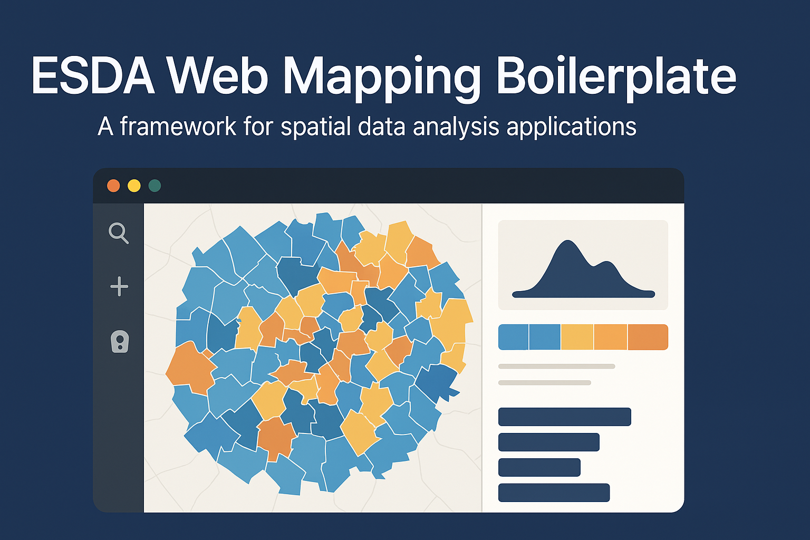

# ESDA Web Mapping Boilerplate

<p align="center">
  
</p>

<p align="center">
  <strong>Modern Spatial Data Analysis Made Beautiful</strong>
</p>

<p align="center">
  <a href="#features">Features</a> •
  <a href="#quick-start">Quick Start</a> •
  <a href="#documentation">Documentation</a> •
  <a href="#examples">Examples</a> •
  <a href="#contributing">Contributing</a>
</p>

## 🌟 Overview

ESDA Web Mapping Boilerplate is a powerful, modern framework for building sophisticated spatial data analysis applications. It combines the robustness of exploratory spatial data analysis (ESDA) with an elegant, user-friendly interface, making complex spatial analysis accessible and beautiful.

## ✨ Features

### 🗺️ Advanced Mapping Capabilities
- **Multi-Library Support**: Seamless integration with OpenLayers, Leaflet, and MapLibre
- **Interactive Visualization**: Dynamic styling, clustering, and animations
- **Custom Controls**: Intuitive layer management and analysis tools

### 📊 Sophisticated Spatial Analysis
- **Network Analysis**: Calculate network metrics and topology statistics
- **Pattern Analysis**: Quadrat analysis, Nearest Neighbor, Ripley's K
- **Geostatistics**: Spatial autocorrelation, variography, kriging
- **Spatial Regression**: OLS, GWR, spatial lag and error models
- **Interpolation**: IDW, kriging, and spline methods

### 🛠️ Developer Experience
- **Modern Stack**: FastAPI backend + React frontend
- **Type Safety**: Full TypeScript support
- **API Documentation**: Auto-generated OpenAPI docs
- **Hot Reloading**: Fast development cycle

### 🎨 Beautiful UI/UX
- **Modern Design**: Clean, intuitive interface
- **Responsive**: Works on all devices
- **Customizable**: Themeable components
- **Accessibility**: WCAG 2.1 compliant

## 🚀 Quick Start

### Prerequisites
- Python 3.8+
- Node.js 16+
- Make (usually pre-installed on Unix systems)
- GDAL and spatial libraries (see [detailed setup guide](docs/setup_guide.md))

### Setup

```bash
# Clone the repository
git clone https://github.com/yourusername/esda-web-mapping-boilerplate.git
cd esda-web-mapping-boilerplate

# Copy and configure environment variables
cp .env.example .env
# Edit .env with your preferred settings

# Install all dependencies and set up development environment
make setup

# Start development environment (both backend and frontend)
make dev
```

### Alternative: Manual Setup

If you prefer more control over the installation process:

```bash
# Backend setup
python -m venv venv
source venv/bin/activate  # On Windows: .\venv\Scripts\activate
pip install -r requirements.txt
pip install -r requirements-dev.txt  # Development dependencies

# Frontend setup
cd frontend
npm install
cd ..

# Start services individually
./scripts/run_backend.sh  # Starts FastAPI server
./scripts/run_frontend.sh # Starts React development server
```

### Verify Installation

Once running, you can access:
- Frontend: http://localhost:3000
- Backend API: http://localhost:8000
- API Documentation: http://localhost:8000/docs

For detailed setup instructions, troubleshooting, and configuration options, see our [Setup Guide](docs/setup_guide.md).

## 📚 Documentation

Visit our [documentation](docs/README.md) to learn more about:
- [Architecture Overview](docs/architecture.md)
- [API Reference](docs/api-reference.md)
- [Component Library](docs/components.md)
- [Spatial Analysis Guide](docs/spatial-analysis.md)
- [Deployment Guide](docs/deployment.md)

## 🎯 Examples

Check out our [examples directory](examples/) for:
- Basic map setup
- Custom layer styling
- Spatial analysis workflows
- Network analysis
- Advanced visualizations

## 🤝 Contributing

We welcome contributions! Please see our [Contributing Guide](CONTRIBUTING.md) for details.

## 📄 License

This project is licensed under the MIT License - see the [LICENSE](LICENSE) file for details.

## 🙏 Acknowledgments

Built with love using:
- [FastAPI](https://fastapi.tiangolo.com/)
- [React](https://reactjs.org/)
- [OpenLayers](https://openlayers.org/)
- [Leaflet](https://leafletjs.com/)
- [MapLibre GL JS](https://maplibre.org/)
- [D3.js](https://d3js.org/)

---

<p align="center">
  Made with ❤️ for the spatial analysis community
</p>