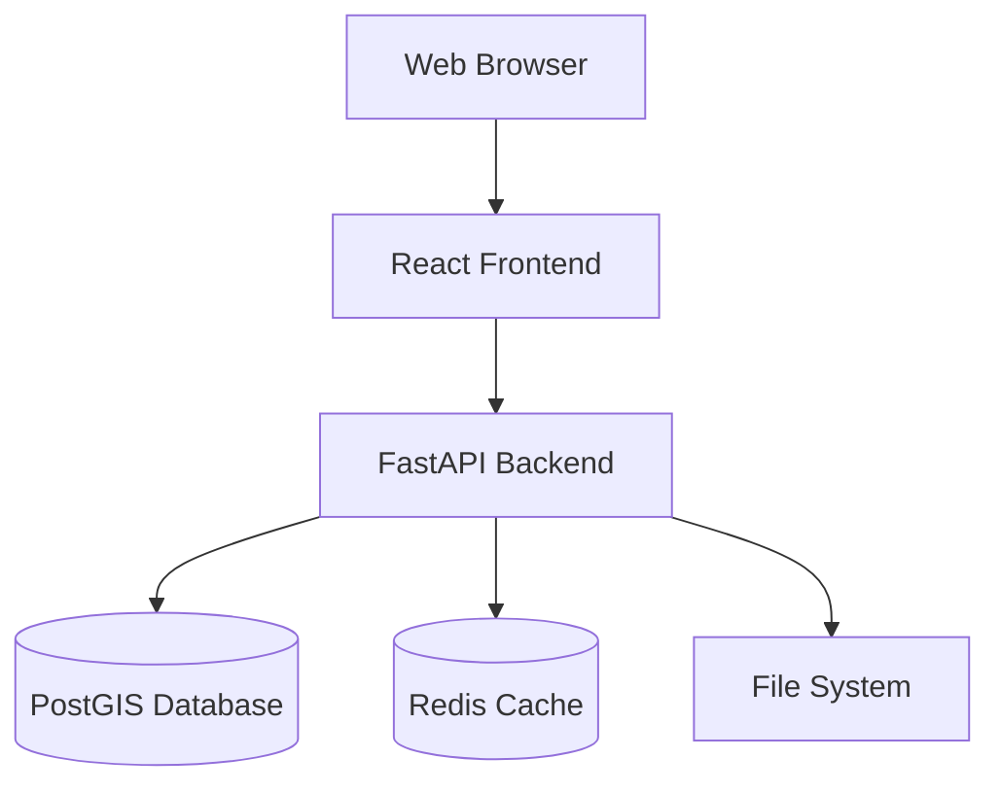
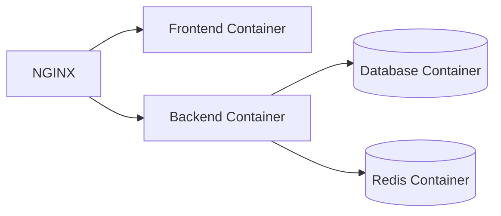

# Architecture Overview

## System Architecture



## Component Overview

### Frontend Architecture

The frontend is built with React and TypeScript, following a modern component-based architecture:

```
frontend/
├── src/
│   ├── components/        # Reusable UI components
│   │   ├── Map/          # Map-related components
│   │   ├── Analysis/     # Analysis tools
│   │   └── Common/       # Shared components
│   ├── hooks/            # Custom React hooks
│   ├── services/         # API services
│   ├── store/            # State management
│   ├── types/            # TypeScript definitions
│   └── utils/            # Utility functions
```

#### Key Technologies
- React 18+ with TypeScript
- OpenLayers/Leaflet/MapLibre for mapping
- D3.js for data visualization
- TailwindCSS for styling
- Vite for build tooling

### Backend Architecture

The backend uses FastAPI with async/await patterns and SQLAlchemy for database operations:

```
backend/
├── app/
│   ├── api/              # API endpoints
│   ├── core/             # Core functionality
│   ├── models/           # Data models
│   ├── services/         # Business logic
│   └── utils/            # Utility functions
```

#### Key Technologies
- FastAPI for API framework
- SQLAlchemy for ORM
- PostGIS for spatial database
- GDAL for spatial operations
- Redis for caching

## Data Flow

### Spatial Data Processing
1. Data ingestion through API endpoints
2. Validation and preprocessing
3. Storage in PostGIS database
4. Caching of computed results
5. Delivery to frontend via REST API

### Analysis Pipeline
1. User initiates analysis in frontend
2. Request sent to backend API
3. Backend processes data using spatial libraries
4. Results cached for future requests
5. Response sent to frontend for visualization

## Security Architecture

### Authentication & Authorization
- JWT-based authentication
- Role-based access control
- API key management for external services

### Data Security
- HTTPS encryption
- Database encryption at rest
- Input validation and sanitization
- Rate limiting and request throttling

## Performance Considerations

### Caching Strategy
- Redis for API response caching
- Browser caching for static assets
- Tile caching for base maps

### Optimization Techniques
- Lazy loading of components
- Database query optimization
- Spatial index utilization
- WebGL rendering for large datasets

## Deployment Architecture

### Container Architecture


### Scaling Strategy
- Horizontal scaling of API servers
- Database replication
- Load balancing
- CDN for static assets

## Monitoring and Logging

### Observability
- Prometheus for metrics
- Grafana for visualization
- ELK stack for log aggregation

### Health Checks
- Database connection monitoring
- API endpoint health checks
- Resource utilization tracking

## Development Workflow

### Local Development
1. Development environment setup via Docker
2. Hot reloading for both frontend and backend
3. Automated testing and linting
4. Local PostGIS database

### CI/CD Pipeline
1. Automated testing
2. Code quality checks
3. Docker image building
4. Automated deployment

## Future Considerations

### Planned Improvements
- GraphQL API support
- Real-time data processing
- Machine learning integration
- Advanced caching strategies

### Scalability Plans
- Microservices architecture
- Kubernetes deployment
- Global CDN distribution
- Multi-region support